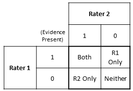

```{r setup, include=FALSE}
knitr::opts_chunk$set(echo = FALSE)
knitr::opts_chunk$set(message = FALSE)
knitr::opts_chunk$set(warning = FALSE)
#knitr::opts_chunk$set(fig.width = 5)
#knitr::opts_chunk$set(fig.height = 4)
source("code/RegressionHelpers.R") 
library(tidyverse)
library(knitr)
library(lme4)
library(irr)
library(kableExtra)
library(ggplot2)
library(gridExtra)
library(openxlsx)
library(textreadr)
library(stringr)
```

### Preliminary work to format data
Pull the data from excel spreadsheet, remove incomplete entries

```{r}
formatdata <- function(){
  
  interndata <- read.xlsx('reflection agreement sheet.xlsx',sheet = 1)
  
  #remove a double entry
  interndata <- interndata[-115,]
  row.names(interndata) <- seq(1,length(interndata[,1]),1)
  
  researchdata <- read.xlsx('reflection agreement sheet.xlsx',sheet = 2)
  #remove some incomplete observations 
  researchdata <- researchdata[-c(29,32,81,82,83,84,85,86,87,88),]
  
  #stack and rename row indexes
  data<- rbind(interndata,researchdata)
  row.names(data) <- seq(1,length(data[,1]),1)
  
  #give some of the columns more useful names
  colIdx <- c(5, 6, 7,8, 10, 11, 12, 13, 15, 16, 17, 18, 19,20,21)
  newnames <- c('career0', 'career1' ,'career2','career3', 'life0', 'life1', 
                'life2', 'life3', 'integ0', 'integ1','integ2','integ3','nLines',
                'docLines','avgwordlength')
  names(data)[colIdx] <-newnames
  #read.xlsx read these differently for some reason
  class(data$life2) <-'character'
  class(data$life3) <-'character'
  #Removing invalid character
  newcell <- unlist(strsplit((data[229,16]), ""))[unlist(strsplit((data[229,16]), 
                                                                  "")) != '?']
  data[229,16] <- paste(newcell, collapse ='')
  data
}
data <- formatdata()
```

Define a function to expand entries in format 'FirstLine-LastLine' into 
consecutive lines    example: '15-20' ---> 15, 16, 17, 18, 19 ,20

Essays are evaluated for 3 different types of evidence: Career insight,
Life Purpose insight, and Coursework integration with extracurricular activities 


```{r}
expandLines <- function(data,ii) {
     #rater1 
      r1careercurrent <- c(strsplit(data$career0[ii],'-'), strsplit(data$career1[ii],'-'), 
                          strsplit(data$career2[ii],'-'),  strsplit(data$career3[ii],'-')  )
      r1careercurrent[is.na(r1careercurrent)] <- NULL
      r1lifecurrent <- c(strsplit(data$life0[ii],'-'), strsplit(data$life1[ii],'-'), 
                        strsplit(data$life2[ii],'-'), strsplit(data$life3[ii],'-')  )
      r1lifecurrent[is.na(r1lifecurrent)] <- NULL
      r1integcurrent <- c(strsplit(data$integ0[ii],'-'), strsplit(data$integ1[ii],'-'), 
                                  strsplit(data$integ2[ii],'-'), strsplit(data$integ3[ii],'-') )
      r1integcurrent[is.na(r1integcurrent)] <- NULL
      
      #rater2 
      r2careercurrent <- c(strsplit(data$career0[ii+1],'-'), strsplit(data$career1[ii+1],'-'), 
                          strsplit(data$career2[ii+1],'-'), strsplit(data$career3[ii+1],'-')  )
      r2careercurrent[is.na(r2careercurrent)] <- NULL
      r2lifecurrent <- c(strsplit(data$life0[ii+1],'-'), strsplit(data$life1[ii+1],'-'), 
                        strsplit(data$life2[ii+1],'-'), strsplit(data$life3[ii+1],'-')  )
      r2lifecurrent[is.na(r2lifecurrent)] <- NULL
      r2integcurrent <- c(strsplit(data$integ0[ii+1],'-'), strsplit(data$integ1[ii+1],'-'), 
                         strsplit(data$integ2[ii+1],'-'), strsplit(data$integ3[ii+1],'-') )
      r2integcurrent[is.na(r2integcurrent)] <- NULL
      
      #calc number lines to set line1 as 1st line of body of essay
      lineshift <- as.numeric(data$docLines[ii])-as.numeric(data$nLines[ii])
      
      #expand these line blocks into list of consecutive lines between 
      #starts/stops, apply the line shift
      r1careerlines <- lapply(r1careercurrent, 
                              function(x) seq(x[1], x[length(x)])-lineshift)     
      r1lifelines   <- lapply(r1lifecurrent,
                              function(x) seq(x[1], x[length(x)])-lineshift)      
      r1integlines  <- lapply(r1integcurrent, 
                              function(x) seq(x[1], x[length(x)])-lineshift)
      r2careerlines <- lapply(r2careercurrent,
                              function(x) seq(x[1], x[length(x)])-lineshift)   
      r2lifelines   <- lapply(r2lifecurrent,
                              function(x) seq(x[1], x[length(x)])-lineshift)   
      r2integlines  <- lapply(r2integcurrent,
                              function(x) seq(x[1], x[length(x)])-lineshift)
      returnList <- list(r1careerlines,r1lifelines,r1integlines,r2careerlines,
                        r2lifelines,r2integlines)
      return(returnList)
     
}  
```
## Comparing Raters
In the calculations that follow, rater pairs vary between 3 individuals.
This initial section assumes that those raters are interchangeable and 
calculates the agreement between rater1 and rater2 regardless of the identity.
Specific raters will be taken into account in a later section.
Define a function to:
Compare Rater1 to Rater2 for agreement or disagreement on evidence for each line
```{r}
compareRaters <- function(lineList,pad=1) {
#all rater1 lines with evidence,  for each of the three categories
      r1careerlines <- lineList[[1]]
      r1lifelines   <- lineList[[2]]
      r1integlines  <- lineList[[3]]
      r2careerlines <- lineList[[4]]
      r2lifelines   <- lineList[[5]]
      r2integlines  <- lineList[[6]]
  
      r1careerlines <- unlist(r1careerlines)
      r1lifelines   <- unlist(r1lifelines)
      r1integlines  <- unlist(r1integlines)
      r2careerlines <- unlist(r2careerlines)
      r2lifelines   <- unlist(r2lifelines)
      r2integlines  <- unlist(r2integlines)
      
      
      #union vector of these lines between the two raters
      careerUnion <- sort(union(r1careerlines,r2careerlines))  
      lifeUnion   <- sort(union(r1lifelines,r2lifelines))  
      integUnion  <- sort(union(r1integlines,r2integlines))
      
      # construct a vector:(career lines present, lifelines present, integration
      # present)   Values with zero in each vector are when the the Union vector
      # had evidence, but the individual rater did not
      r1Vec <- c(careerUnion %in% r1careerlines, lifeUnion%in% r1lifelines,
                 integUnion %in% r1integlines )*1
      r2Vec <- c(careerUnion %in% r2careerlines, lifeUnion%in% r2lifelines,
                 integUnion %in% r2integlines )*1
      
      #if requesting zero padding
      if(pad==1){
      #pad all unmarked lines FOR EACH of 3 SECTIONS with zeros
      padAmount <- 3*as.numeric(data$nLines[[ii]]) - (length(careerUnion)
                                +length(lifeUnion)+length(integUnion) )
      r1Vec <- append(r1Vec,rep(0,padAmount))
      r2Vec <- append(r2Vec,rep(0,padAmount))
    
      }
      
      #return
      returnList <- list(r1Vec,r2Vec)
      return(returnList)
      
}
```
Iterate through each pair of raters on each essay. Each iteration constructs an 
agreement vector for rater1 and rater2. Append these end to end to to form 2
long vectors representing all observations of agreement. Check for proper length.
Since each essay is evaluated 3x (career, life, integration), The total number 
of components for the raters should be 
sum( 3(nLinesEssay1 + nLinesEssay2 ...nLinesEssayK)) 

```{r}
r1TotalVec   <- NULL
r2TotalVec   <- NULL
for(ii in seq(1,length(data[,1]),2)) { 
  
  lineList    <- expandLines(data,ii)
  currentVecs <- compareRaters(lineList,pad=1)
  r1TotalVec  <- append(r1TotalVec, currentVecs[[1]])
  r2TotalVec  <- append(r2TotalVec, currentVecs[[2]])

}
#check for proper length
# /2 to avoid double count, each rater has own row on spreadsheet
check = sum(as.numeric(data$nLines)*3)/2
if(check == length(r1TotalVec)){print('Correct Length')
  } else {print('Incorrect Length')} 
  

```

## Calculate the Cosine Similarity of the two raters
(cite whoever used this idea on docs first)
Cosine similarity is used to consider each rater as a vector. We define each 
component of a rater's vector as an indication of the present of evidence the
rater is looking for. In our case, this is evidence of Career insight, Life 
Goal insight, and integration of coursework with extracurricular activity. 
For simplicity, our vectors are binary, meaning each component can only be 0 or
1 for lack of evidence of presence of evidence respectively. 
Since each essay is evaluated for three types of evidence, each line is
associated with three components in the vector to represent all three types of
evidence. An example is provided below (do that later)

Since the raters are now represented as vectors, we can evaluated their 
similarity by considering the degree to which they point in the same direction.
Two vectors pointing close to the same direction will have a smaller angle 
between them. Two vectors with more considerable differences in the lines they 
marked will not produce as small an angle. 

The scale of similarity in this method ranges for 0 to 1. The former having no 
similarity and latter exhibiting complete agreement on all lines. 

$$
Cos(\Theta) = \frac{\vec{r1}*\vec{r2}}{\left \| r1 \right \|\left \| r2 \right \|}
$$


```{r}
CosSim <-(   (r1TotalVec %*% r2TotalVec) / 
                    (sqrt(sum(r1TotalVec^2)) * sqrt(sum(r2TotalVec^2)))  )
CosSim
```
** note to self, we have no statistic or threshold here, just a number, what do
we reference it against **

## Calculate Cohen Kappa between the two raters
(Note to self, do I need to cite the guy who made this function?)
Cohen's Kappa is a statistic to compare interrater agreement. This statistic
takes into account the amount of agreement that could be due to random chance.
This is calculated by taking the difference of observed agreement and expected 
agreement and normalizing as below:
$$
\kappa =\frac{p_{o}-p_{e}}{1-p_{e}} 
$$
Where the Po is the observed agreement and Pe is the probability of agreement
by chance. Pe is calculated from the table and is based on the frequencies of
positive and negative responses from each of the two raters. 



```{r}
kappa2(cbind(r1TotalVec,r2TotalVec))
```

## One rater's ability to predict the other
Considering Rater 1 as a predictor of Rater 2, we define True Postives as lines 
where raters agreed that evidence was present. we define True Negatives as lines 
where both agreed no evidence was found. In the case of Rater 1 predicting
Rater 2, we define False Positives as lines marked as evidence by Rater 1 only.
This leaves False Negatives defined as lines marked only by Rater 2 and 'missed'
by Rater 1. We can measure the predictive ability of Rater 1 by calculating
the difference between the rate of correct predictions and the rate of 'missed'
predictions. This is known as Gini's Coeffecient?? (Cite Eubanks here)
$$ 
\epsilon = TPR - FNR
         = \frac{TP}{TP+FP} -\frac{FN}{FN+TN}
$$
This can be thought of as the probability that Rater 1 predicts a positive
response from Rater2, minus the probability that Rater 1 misses a positive 
response

```{r}
fP <- length(which(r1TotalVec == 1 & r2TotalVec == 0))
fN <- length(which(r2TotalVec == 1 & r1TotalVec == 0))
tP <- length(which(r1TotalVec == 1 & r2TotalVec == 1))
tN <- length(which(r1TotalVec == 0 & r2TotalVec == 0))

epsilon  <- (tN*tP - fN*fP) / ((tN+fN)*(fP+tP) )
print(c('Epsilon is = ',epsilon))
# note so self, figure out how to format floats
```

## Area under Reciever Operator Curve
AUC is a measurement that evaluates the effectiveness of classification. In our
case this is the ability of Rater1 to correctly classify a line as holding 
evidence or lacking evidence, based on the template that Rater 2 establishes.

AUC can be calculated by taking the average of the the True Positive Rate
and the True Negative Rate. 

An AUC of .5 indicates that Rater 1 classifications are no better than random. 
An AUC of 1 indicates absolute correctness in classification of both 
evidence-bearing lines and evidence-lacking lines
$$
AUC =\frac{ (TPR - TNR)}{2}
         = \frac{\frac{TP}{TP+FP} -\frac{TN}{TN+FP}}{2}
$$
```{r}
auc <- (tP/(tP+fN) +(tN/(tN+fP)) )/2
auc
```

## Cosine Similarity vs Cohen's Kappa 
In order to evaulate the correlation between these two metrics, we must apply 
them to essays individually instead of concatenating all observations into one.

On certain essays, an individual rater might not observe any evidence. When 
constructing their comparison vector, this would amount to a vector of magnitude
0, which cannot be compared to another vector with a non-zero magnitude. We 
manually define this similarity to be 0 to represent lack of agreement and avoid
NaNs in our data. 
We run into similar problems when both raters observe no evidence, yield two 
vectors of magnitude zero. We consider this to be complete agreement and assign
a Cosine Similarity value of 1 in this instance. 
```{r warning=FALSE}

cosSim <- NULL
kappaVals  <- NULL
for(ii in seq(1,length(data[,1]),2)) { 
  
  lineList    <- expandLines(data,ii)
  currentVecs <- compareRaters(lineList,pad=1)
  r1Vec <- currentVecs[[1]]
  r2Vec <- currentVecs[[2]]
  
  #calculate Cosine Similarity
      #one rater has no marked lines
  if( xor(sqrt(sum(r1Vec^2)), sqrt(sum(r2Vec^2))) ) {
        currentCosSim <- 0
        #both agree no evidence, both vectors mag is 0
      } else if(sum(r1Vec)== 0 && sum(r2Vec)==0  )  {
        currentCosSim <- 1
      } else {
        currentCosSim <-(   (r1Vec %*% r2Vec) / (sqrt(sum(r1Vec^2)) * 
                                                   sqrt(sum(r2Vec^2)))  )  
      }
  
  cosSim <- append(cosSim,as.numeric(currentCosSim))
  
  if(is.na(currentCosSim)) {
      print(ii)
      print(r1Vec)
      print(r2Vec)
      }
  
  # calculate Cohen's Kappa
  kappaVals <- append(kappaVals,kappa2(cbind(r1Vec,r2Vec))[[5]])
  
  df = data.frame(cosSim,kappaVals)
  #remove rows where we can't calculate Kappa
  df = df[!is.na(df)[,2],]
}
```
A few Kappa calculations  result in NaNs when no lines are marked for either 
rater
We remove these and plot Kappa vs Cosine Similarity for each essay


```{r pressure, echo=FALSE}
g = ggplot(df, aes (cosSim,kappaVals))+geom_point(color='steelblue',size=2)+ geom_smooth(method = 'lm')+labs(title='Kappa vs Cosine Similarity') + labs(x='Cosine Similarity',y='Kappa')
g
```
```{r, echo=FALSE}
print(c('Pearson Correlation ',format(cor(df),digits=4)[1,2]))
```
```{r,echo = FALSE}

p1 <- ggplot(df, aes(x=cosSim)) + geom_histogram(bins = 25,color='white')+labs(title='Cosine Similarities')+labs(xlab='Cosine Similarity')+geom_vline(xintercept = mean(df$cosSim),
linetype='dashed',color ='red')

p2 <- ggplot(df, aes(x=kappaVals)) + geom_histogram(bins = 25,color='white')+labs(title='Kappa Values')+labs(xlab='Kappa')+geom_vline(xintercept = mean(df$kappaVals),
linetype='dashed',color ='red')
grid.arrange(p1, p2, nrow = 1)

```
```{r,echo=FALSE}
print(c('Mean Cosine Similarity ', format(mean(df$cosSim),
                                          digits=5)))
print(c('Mean Kappa Value', format(mean(df$kappaVals),
                                          digits=5)))
```
## Comparing Specific Raters
Do they perform to a similar degree

Establishing lists for each unique pair
```{r warning=TRUE}
AZHY <- NULL
AZPC <- NULL
HYPC <- NULL
for(ii in seq(1,length(data[,1]),2)){
  if ('AZ' %in% data$Coder.initials[c(ii,ii+1)] & 'HY' %in% 
      data$Coder.initials[c(ii,ii+1)]){
    AZHY <- append(AZHY,ii)
  } else if('AZ' %in% data$Coder.initials[c(ii:ii+1)] & 'PC' %in% 
            data$Coder.initials[c(ii,ii+1)]){
            AZPC <- append(AZPC,ii)
  } else {HYPC <- append(HYPC,ii)}
}


```
Reusing Code from above to compare specific raters to each other
```{r warning=FALSE}
SpecificRaters <- function(data,raterList){
cosSim <- NULL
kappaVals  <- NULL
for(ii in raterList){ 
  
  lineList    <- expandLines(data,ii)
  currentVecs <- compareRaters(lineList,pad=1)
  r1Vec <- currentVecs[[1]]
  r2Vec <- currentVecs[[2]]
  
  #calculate Cosine Similarity
      #one rater has no marked lines
  if( xor(sqrt(sum(r1Vec^2)), sqrt(sum(r2Vec^2))) ) {
        currentCosSim <- 0
        #both agree no evidence, both vectors mag is 0
      } else if(sum(r1Vec)== 0 && sum(r2Vec)==0  )  {
        currentCosSim <- 1
      } else {
        currentCosSim <-(   (r1Vec %*% r2Vec) / (sqrt(sum(r1Vec^2)) * 
                                                   sqrt(sum(r2Vec^2)))  )  
      }
  
  cosSim <- append(cosSim,as.numeric(currentCosSim))
  
  # calculate Cohen's Kappa
  kappaVals <- append(kappaVals,kappa2(cbind(r1Vec,r2Vec))[[5]])
  
  df2 = data.frame(cosSim,kappaVals)
  #remove rows where we can't calculate Kappa
  #where neither rater marks any lines
  df2 = df2[!is.na(df2)[,2],]
}
  return(list(mean(df2$cosSim), mean(df2$kappaVals)))
}
```

Defining a function to compare specific raters while concatenating essays
```{r}
SpecificRatersConcat <- function(data,raterList){
r1TotalVec   <- NULL
r2TotalVec   <- NULL
for(ii in raterList) { 
  
  lineList    <- expandLines(data,ii)
  currentVecs <- compareRaters(lineList,pad=1)
  r1TotalVec  <- append(r1TotalVec, currentVecs[[1]])
  r2TotalVec  <- append(r2TotalVec, currentVecs[[2]])
}
CosSim <-(   (r1TotalVec %*% r2TotalVec) / 
               (sqrt(sum(r1TotalVec^2)) * sqrt(sum(r2TotalVec^2)))  )
 
kappaVal <- kappa2(cbind(r1TotalVec,r2TotalVec))

return(list(CosSim,kappaVal))
}

```

```{r warning=FALSE}
AZHYShort <- SpecificRaters(data,AZHY)
AZHYLong  <- SpecificRatersConcat(data,AZHY)
AZPCShort <- SpecificRaters(data,AZPC)
AZPCLong  <- SpecificRatersConcat(data,AZPC)
HYPCShort <- SpecificRaters(data,HYPC)
HYPCLong  <- SpecificRatersConcat(data,HYPC)
```
```{r}
#make table of these comparisons
df = data.frame(unlist(AZHYShort),unlist(AZPCShort),unlist(HYPCShort),row.names = 
           c('Cosine Similarity','Kappa'))
colnames(df) <-c('AZ/HZ','AZ/PC','HY/PC')
df %>% kable(caption = 'Agreement with Separated Essays',digits = 4,
              table.attr = "style='width:30%;'") %>% 
    kable_styling(bootstrap_options = c("striped", full_width = F))


```


```{r}
df2 = data.frame(c(AZHYLong[[1]],AZHYLong[[2]][[5]]),
                 c(AZPCLong[[1]],AZPCLong[[2]][[5]]),
                 c(HYPCLong[[1]],HYPCLong[[2]][[5]]),
                 row.names = c('Cosine Similarity','Kappa'))
colnames(df2) <-c('AZ/HZ','AZ/PC','HY/PC')

df2 %>% kable(caption = 'Agreement using concatenated Essays',digits = 4,
              table.attr = "style='width:30%;'") %>% 
    kable_styling(bootstrap_options = c("striped", full_width = F))
```
Similar performance with different rater pairs, especially when essays are concatenated together.

```{r}
# for career
careerlines <- NULL
totaldf     <- data.frame(NULL)
#for each essay, add to vectors, vectors combined in dataframe later
for( ii in seq(1,length(data[,1]),2)) {
  nlines = as.numeric(data$nLines[ii])
  avgwordlen = as.numeric(data$avgwordlength[ii])
  rater1 = data$Coder.initials[ii]
  rater2 = data$Coder.initials[ii+1]
  #initialize vectors
  docvec        <- rep((ii+1)/2,2*nlines) #since stride is 2, need (ii+1)/2
  ratervec      <- c(rep(rater1,nlines),rep(rater2,nlines))
  linenumvec    <- rep(seq(1,nlines),2)
  nlinesvec     <- rep(nlines,2*nlines)
  avgwordlenvec <- rep(avgwordlen,2*nlines)
  #get marked lines
  r1lines <- unlist(expandLines(data,ii)[1]) #1 is r1careerlines
  r2lines <- unlist(expandLines(data,ii)[4]) #4 is r2careerlines
  #populate which lines they marked
  r1markedvec <-(linenumvec[1:nlines] %in% r1lines)*1
  r2markedvec <-(linenumvec[1:nlines] %in% r2lines)*1
  
  essaydf<- data.frame('Doc'=docvec,'Rater'=ratervec,'LineNumber'=linenumvec,
                       'Marked'=c(r1markedvec,r2markedvec),'Nlines'=nlinesvec,
                       'AvgWordLength'=avgwordlenvec)
  totaldf = rbind(totaldf,essaydf)
  }

model <- glmer(Marked ~ Nlines + AvgWordLength + (1|Doc)+(1|Rater),family = 'binomial',data=totaldf)
plot_coefs(model)

```

```{r}

test_model <- glm(Marked ~ Nlines + AvgWordLength + Rater , family = "binomial", data = totaldf)
plot_coefs(test_model)
```
```{r}
compute_AUC(m = test_model, ROC = TRUE)
```


-------------------------------------------------------------------------------
I use this section to manually update the spreadsheet to include average word
length for each author. Included just for reference
```{r}
library(tm)
avglengthfxn <- function(file){
  print(file)
  doc = read_docx(file)
  doc = removePunctuation(doc)
  mywords = unlist(strsplit(doc[-1],' '))
  lengths = as.numeric(lapply(mywords,function(x) nchar(x)))
  avglength = mean(lengths)
}
```


```{r}
doclist = list()
avglist = list()
current = getwd()
setwd(paste(current,'/Internships 2019',sep = ''))

fileslistintern = data$Artifact.title[1:226]
fileslistresearch = data$Artifact.title[228:304]

#for internship page
for(file in fileslistintern){
  #clean the titles of documents, rename with proper extension
  if(!(str_detect(file,'docx'))){file = paste(file,'.docx',sep='')}
  if(str_detect(file,'.pages')){
    a = str_locate(file,'.pages')
    file = paste(substring(file,1,a[1]-1),substring(file,a[2]+1),sep='')
  }
  if(str_detect(file,'.pdf')){
    a = str_locate(file,'.pdf')
    file = paste(substring(file,1,a[1]-1),substring(file,a[2]+1),sep='')
  }
  # I couldnt accomodate this essay, characters throw off?
  if(str_detect(file,'副本 副本')){
    4.916561 
    next
  }
  
  doclist <- append(doclist, tail(unlist(strsplit(file,'/')),1))
  avglist <- append(avglist,avglengthfxn(file))
}
# a dataframe for me to copy/paste to new excel column
dfavgs1 = data.frame(cbind(avglist,doclist))

#for research page
setwd(paste(current,'/Research 2019',sep=''))
doclist = list()
avglist = list()

for(file in fileslistresearch){
  if(!(str_detect(file,'docx'))){file = paste(file,'.docx',sep='')}
  if(str_detect(file,'.pdf')){
    a = str_locate(file,'.pdf')
    file = paste(substring(file,1,a[1]-1),substring(file,a[2]+1),sep='')
  }
  doclist <- append(doclist, tail(unlist(strsplit(file,'/')),1))
  avglist <- append(avglist,avglengthfxn(file))
}
dfavgs2 = data.frame(cbind(avglist,doclist))


```


